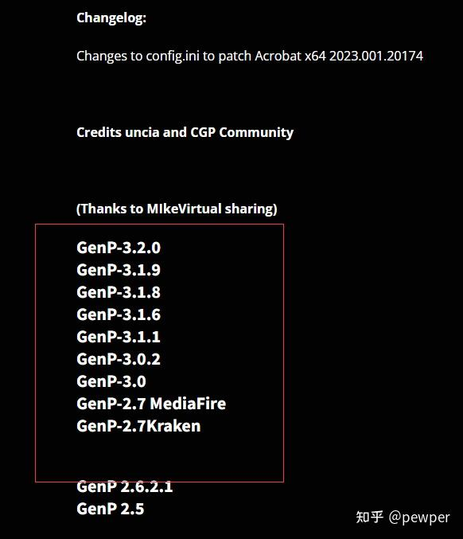
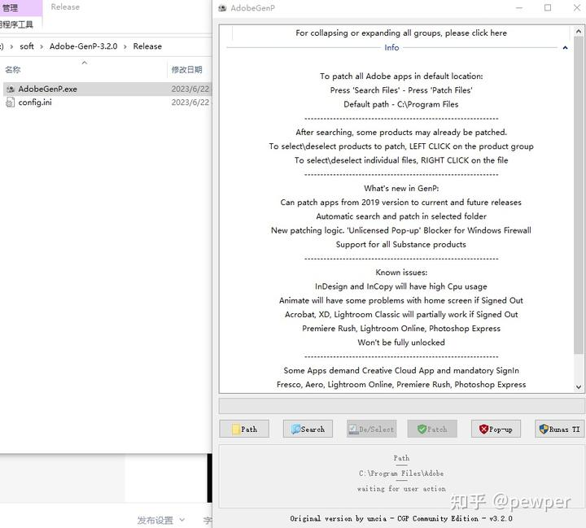

AdobeGenP适用于Adobe系列软件的激活

下载地址：[https://www.cybermania.ws/software/adobe-genp/](https://link.zhihu.com/?target=https%3A//www.cybermania.ws/software/adobe-genp/)

3.2版本适用 Adobe CC 2019/2020/2021/2022/2023/2024

点击上面的GenP-3.2.0版本。

在弹出的页面点DOWNLOAD下载。

解压缩包，运行release目录下的adobegenp.exe

界面如上。

使用方法：

If you want to patch all Adobe apps in default location:

Press ‘Search Files’ – wait until GenP finds all files.

Press ‘Pill Button’ – wait until GenP do it’s job.

One Adobe app at a time:

Press ‘Custom path’ – select folder that you want \[depending upon the app you want to patch\]

Press ‘Search Files’ – wait until GenP finds all files.

Press ‘Pill Button’ – wait until GenP do it’s job.

因为下载的是英文版。怕你找不到英文按钮。所以就直接复制了网站的英文用法说明。

简单用法就是：先点search按钮，等会有结果了，再点patch就好了。

成功了回来谢谢我。